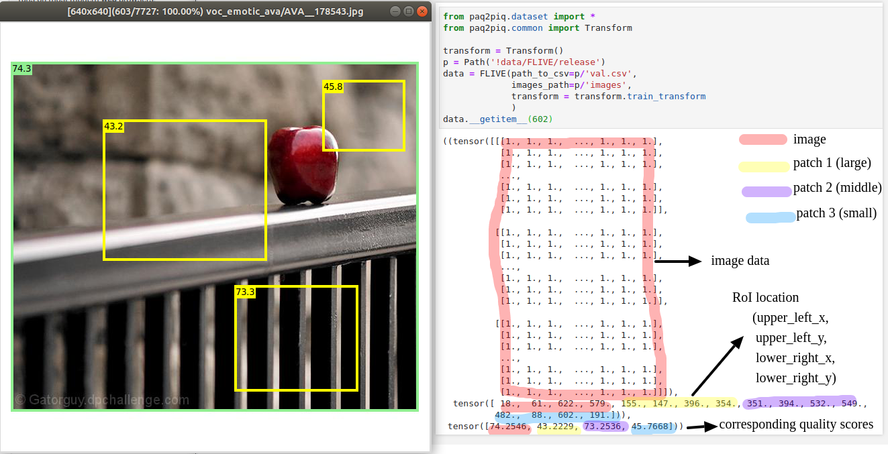

# PyTorch PaQ-2-PiQ: Patch Quality 2 Picture Quality Prediction

PyTorch implementation of [PaQ2PiQ](https://github.com/baidut/PaQ-2-PiQ)

## Demo

<a href="https://colab.research.google.com/github/baidut/paq2piq/blob/master/demo.ipynb" target="_parent"></a>

## Get Started

Check out [`demo.ipynb`](demo.ipynb)

get predicts from a file:

```python
model = InferenceModel(RoIPoolModel(), 'models/RoIPoolModel.pth')
output = model.predict_from_file("images/Picture1.jpg")
```

predict from a PIL image:

```python
model = InferenceModel(RoIPoolModel(), 'models/RoIPoolModel.pth')
image = Image.open("images/Picture1.jpg")
output = model.predict_from_pil_image(image)
```

The output would be a dictionary:

```python
output['global_score'] # a float scale number indicating the predicted global quality
output['local_scores']  # a 20x20 numpy array indicating the predicted  local quality scores
output['category']  # From low to high quality: 'Bad', 'Poor', 'Fair', 'Good', 'Excellent'
```

## Installing

```bash
git clone https://github.com/baidut/paq2piq
cd paq2piq
virtualenv -p python3.6 env
source ./env/bin/activate
pip install -r requirements.txt
```


## Dataset

The model was trained on FLIVE. You can get it from [here](https://github.com/niu-haoran/FLIVE_Database/blob/master/database_prep.ipynb). (Feel free to create an issue [here](https://github.com/niu-haoran/FLIVE_Database/issues) if you encountered any problem)
For each image, we cropped three different-sized patches. The image data and patch location is taken as input while their scores as output. Here is an example:


## Model 

Used ResNet18 pretrained on ImageNet as backbone 

## Pre-trained model  

[Download](https://github.com/baidut/PaQ-2-PiQ/releases/download/v1.0/RoIPoolModel-fit.10.bs.120.pth) 

## Train it with Pytorch-lightning

```python
from pytorch_lightning_module import *
module = RoIPoolLightningModule()
trainer = pl.Trainer(gpus=[0])    
trainer.fit(module)
```

## Train it with Pure-Pytorch

Change the settings here:

```bash
export PYTHONPATH=.
export PATH_TO_MODEL=models/RoIPoolModel.pth
export PATH_TO_IMAGES=/storage/DATA/images/
export PATH_TO_CSV=/storage/DATA/FLIVE/
export BATCH_SIZE=16
export NUM_WORKERS=2
export NUM_EPOCH=50
export INIT_LR=0.0001
export EXPERIMENT_DIR_NAME=/storage/experiment_n0001
```
Train model
```bash
python cli.py train_model --path_to_save_csv $PATH_TO_CSV \
                                --path_to_images $PATH_TO_IMAGES \
                                --batch_size $BATCH_SIZE \
                                --num_workers $NUM_WORKERS \
                                --num_epoch $NUM_EPOCH \
                                --init_lr $INIT_LR \
                                --experiment_dir_name $EXPERIMENT_DIR_NAME
```
Use tensorboard to tracking training progress

```bash
tensorboard --logdir .
```
Validate model on val and test datasets
```bash
python cli.py validate_model --path_to_model_state $PATH_TO_MODEL \
                                    --path_to_save_csv $PATH_TO_CSV \
                                    --path_to_images $PATH_TO_IMAGES \
                                    --batch_size $BATCH_SIZE \
                                    --num_workers $NUM_EPOCH
```
Get scores for one image
```bash
python cli.py get-image-score --path_to_model_state $PATH_TO_MODEL \
--path_to_image test_image.jpg
```

## Contributing

Contributing are welcome

## Acknowledgments

* [PyTorch NIMA: Neural IMage Assessment](https://github.com/truskovskiyk/nima.pytorch)
* https://github.com/vdouet/Discriminative-learning-rates-PyTorch

